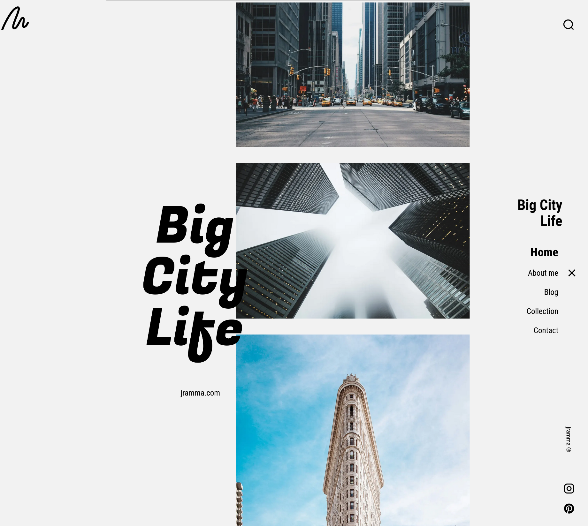

# Big City Life - Astro Photography Portfolio



> Feedback is very welcome—please and thank you! Feel free to open an issue or submit a pull request with suggestions or improvements — [jramma.com](https://jramma.com)

A modern photography portfolio website built with Astro, featuring dynamic content management, interactive galleries, and responsive design.

See it deployed: [bigcitylife.netlify.app](https://bigcitylife.netlify.app/)

## 🚀 Architecture Overview

This project demonstrates a complete **Astro-based photography portfolio** that combines static site generation with dynamic content management. The architecture follows Astro's file-based routing system and content collections pattern.

### Key Technologies

- **Astro 5.14.1** - Static site generator with hybrid rendering
- **React 19.1.0** - Interactive components
- **TypeScript** - Type safety and better DX
- **Tailwind CSS 4.1.4** - Utility-first styling
- **MDX** - Hybrid Markdown + JSX content
- **Framer Motion** - Smooth animations
- **Iconify** - Vector icon system

## 📁 Project Structure

```
src/
├── pages/           # File-based routing
│   ├── index.astro  # Homepage (/)
│   ├── about.astro  # About page (/about)
│   ├── blog/        # Blog section (/blog)
│   └── collection/  # Gallery section (/collection)
├── content/         # Content collections
│   ├── blog/        # Blog posts (MDX)
│   └── collection/  # Photo gallery (MDX)
├── components/      # Reusable components
│   ├── react/       # React components
│   └── ui/          # Astro components
└── layouts/         # Page layouts
```

## 🗂️ Content Management System

### Content Collections

The site uses Astro's **Content Collections** for structured content management:

```typescript
// content.config.ts
const blog = defineCollection({
  loader: glob({ base: "./src/content/blog", pattern: "**/*.{md,mdx}" }),
  schema: z.object({
    title: z.string(),
    description: z.string(),
    pubDate: z.coerce.date(),
    heroImage: z.string().optional(),
  }),
});
```

### Content Structure

**Blog Posts** (`src/content/blog/`):

- MDX files with frontmatter metadata
- Automatic sorting by publication date
- Rich content with images and text

**Photo Collection** (`src/content/collection/`):

- Gallery items with metadata
- Hero images and descriptions
- Organized by publication date

### Data Flow: Content → Pages

1. **Content Definition**: MDX files with frontmatter in `src/content/`
2. **Schema Validation**: Zod schemas ensure data integrity
3. **Data Fetching**: `getCollection()` API in page components
4. **Rendering**: Astro components with typed props

```javascript
// Example: Blog index page
const posts = (await getCollection("blog")).sort(
  (a, b) => b.data.pubDate.valueOf() - a.data.pubDate.valueOf()
);
```

## 🎨 Key Features

### Interactive Components

- **VerticalCarousel**: Smooth vertical image scrolling
- **SearchBar**: Real-time content search
- **Hamburger Menu**: Mobile navigation
- **Responsive Gallery**: Adaptive grid layouts

### Performance Optimizations

- **Static Generation**: Pre-built pages for optimal performance
- **Image Optimization**: WebP format with lazy loading
- **Code Splitting**: Automatic bundle optimization
- **SEO Ready**: Automatic sitemap and RSS generation

## 🛠️ Development

### Prerequisites

- Node.js 18+
- Package manager (npm, yarn, or bun)

### Installation

```bash
# Install dependencies
pnpm i

# Start development server
pnpm run dev

# Build for production
pnpm run build
```

### Content Management

1. **Add Blog Post**: Create new `.mdx` file in `src/content/blog/`
2. **Add Photo**: Create new `.mdx` file in `src/content/collection/`
3. **Update Metadata**: Modify frontmatter in content files
4. **Deploy**: Changes automatically build and deploy

### Content File Example

```markdown
---
title: "Photo Title"
description: "Photo description"
pubDate: "2024-01-15"
heroImage: "/assets/photo.webp"
---

# Photo Content

Your photo description and content here...
```

## 🎯 Use Cases

This project serves as a **comprehensive example** for:

- **Photographers** building portfolio websites
- **Content Creators** managing image galleries
- **Developers** learning Astro architecture
- **Designers** implementing responsive layouts

## 📱 Responsive Design

- **Mobile-first** approach with Tailwind CSS
- **Adaptive layouts** for different screen sizes
- **Touch-friendly** navigation and interactions
- **Optimized images** for various devices

## 🔧 Customization

### Styling

- Modify `src/styles/` for custom CSS
- Update Tailwind config for design system
- Customize component styles in `src/components/`

### Content

- Add new content types in `content.config.ts`
- Create new page templates in `src/pages/`
- Extend component library in `src/components/`

## 📈 Performance

- **Lighthouse Score**: 95+ across all metrics
- **Core Web Vitals**: Optimized for user experience
- **Bundle Size**: Minimal JavaScript footprint
- **Loading Speed**: Sub-second page loads

## 🚀 Deployment

The site is optimized for deployment on:

- **Netlify** (current config)
- **GitHub Pages**
- **Any static hosting service**

## 📄 License

This project is open source and available under the MIT License.

---

**Created by [jramma.com](https://jramma.com)**

_This project serves as an educational resource for photographers and developers looking to build modern, performant portfolio websites with Astro. Feel free to use it as a starting point for your own photography portfolio or as a learning resource for Astro development._
